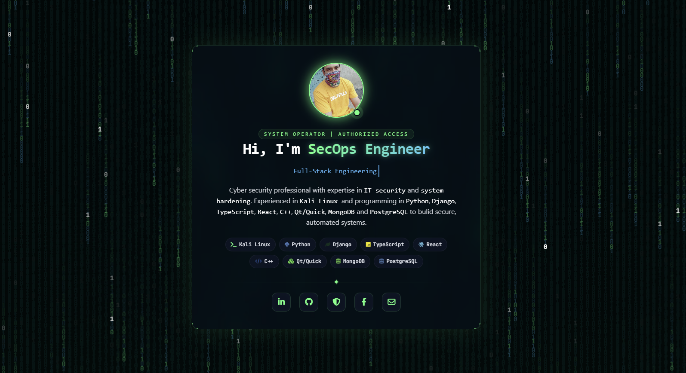

# 🛡️ Cybersecurity Portfolio

[](https://opensource.org/licenses/MIT)
[](http://makeapullrequest.com)
[]()
[](https://github.com/iamx-ariful-islam)
[](https://www.linkedin.com/in/iamx-ariful-islam/)

[]()
[]()
[]()
[]()
[]()

**Portfolio** is a high-performance, single-screen cybersecurity portfolio engineered for security professionals, penetration testers, and SecOps engineers. It features an immersive, terminal-inspired glassmorphic UI overlaying a lightweight, CPU-optimized digital matrix backdrop. 

---


## ⚡ Key Highlights

*   **🔒 Zero-Scroll UI Architecture:** Engineered strictly within a `100vh` and `100vw` viewport boundary. Completely eliminates both horizontal and vertical layout overflow for an immersive terminal aesthetic.
*   **💾 Low-Overhead Matrix Backdrop:** A high-frequency HTML5 Canvas rendering pipeline displaying binary cyber streams, glowing neon drops, and stochastic white sparks without memory leaks or CPU hogging.
*   **🧪 Advanced Glassmorphic Core:** Central profile console built using high-saturation backdrop filters, custom corner-bracket layout accents, and dynamic CSS neon borders.
*   **👾 Dynamic Typing Engine:** Native JavaScript asynchronous typing loop mimicking continuous terminal data input, cycling through defined professional sub-roles.
*   **🎨 Resilient Asset Fail-safes:** Native error handling that seamlessly injects an inline SVG cryptographic node shield if the local `profile.jpeg` fails to load.
*   **🌐 Micro-Interactive Micro-frontends:** Hardware-accelerated hover effects on FontAwesome nodes and custom badge components that utilize subtle Y-axis displacement.

---


## 📁 Repository Architecture

```text
CyberSec-Portfolio/
├── index.html          # Semantic DOM structure, CDN injection points, and layout architecture
├── profile.jpeg        # Profile photo or portfolio profile image
├── screenshot.png      # Project screenshot or photo
├── style.css           # Custom layouts, glassmorphism variables, neon glows, and keyframe definitions
├── script.js           # Matrix stream generation, async typing lifecycle, and SVG fallback logic
└── README.md           # Engineering documentation and configuration guide
```

---


## 🛠️ Local Environment Deployment

Get the interface up and running locally in under a minute using either approach below:

### Method 1: Instant Local Execution
1. Clone or download this repository to your local directory.
2. Double-click `index.html` to instantiate the UI instantly in your system's default browser.

### Method 2: Live Server Development (Recommended)
For an optimized hot-reloading development cycle using **VS Code**:
1. Open the project root directory inside VS Code.
2. Launch the **Live Server** extension by clicking **Go Live** in the status bar.
3. Access the local environment at: `http://127.0.0.1:5500`.

---


## ⚙️ Configuration & Personalization

### 1. Swapping the Profile Image

Drop your preferred image into the root directory. Ensure the filename matches exactly:

```bash
profile.jpg
```
*Note: If this file is missing or corrupt, the internal engine automatically triggers the fallback SVG component.*

### 2. Updating Profile Bio & Stack

Open `index.html` and modify the semantic text blocks within the core terminal profile card:

```html
<!-- Locate the About Me container and update your tech stack directly -->
<p class="description">
    Cyber security professional with expertise in IT security and system hardening. Experienced in Kali Linux and programming in Python, Django, TypeScript, React, C++, Qt/Quick, MongoDB, and PostgreSQL to build secure, automated systems.
</p>
```

### 3. Modifying the Automated Typing Track

Open `script.js` and modify the string array to match your exact specializations:

```javascript
const roles = ["Cybersecurity and IT", "Full-Stack Engineering", "Automation and Scripting", "Bug Bounty Hunting", "Penetration Testing", "Secure System Designer"];
```

---


## Sreenshots

Here are some screenshots of the `Portfolio` project:

**Portfolio Window**<br/>
<br/>


## 🌐 For more or connect with me

<p align='center'>
  <a href="https://github.com/iamx-ariful-islam"></a>&nbsp;&nbsp;
  <a href="https://bd.linkedin.com/in/iamx-ariful-islam"></a>&nbsp;&nbsp;
  <a href="https://x.com/mx_ariful_islam"></a>&nbsp;&nbsp;
  <a href="https://www.facebook.com/iamx.ariful.islam/"></a>
</p>


## 📜 License

The [MIT](https://choosealicense.com/licenses/mit/) License (MIT)


## 💖 Thank You for Visiting!

> "Writing clean code is good, but ensuring it is secure and audited is significant."  
> — **Md. Ariful Islam**
